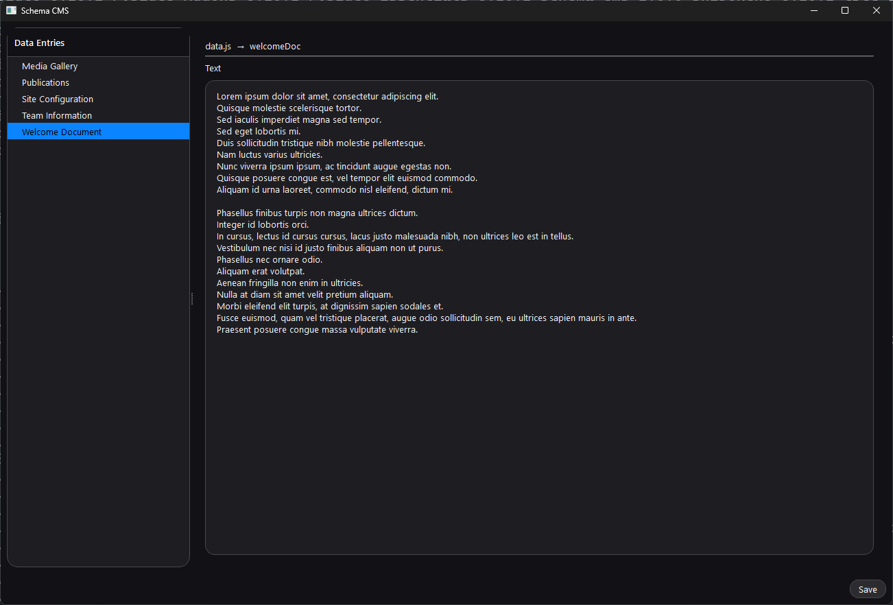
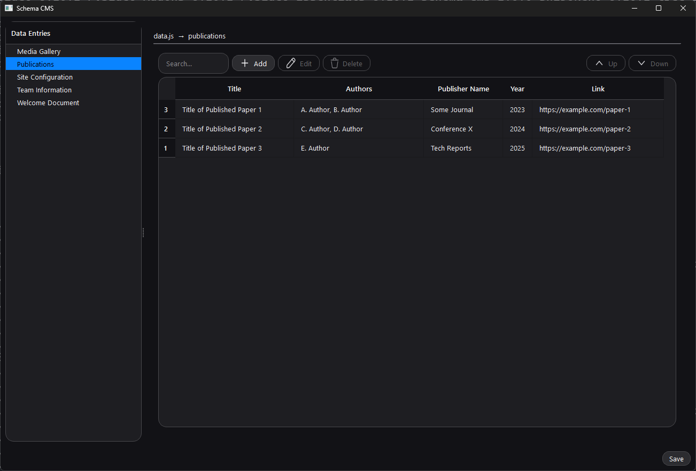
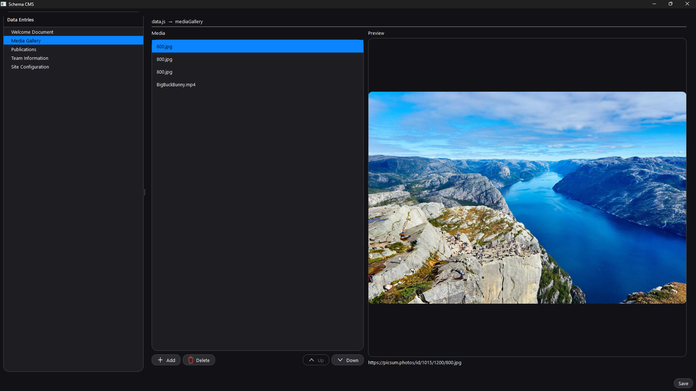
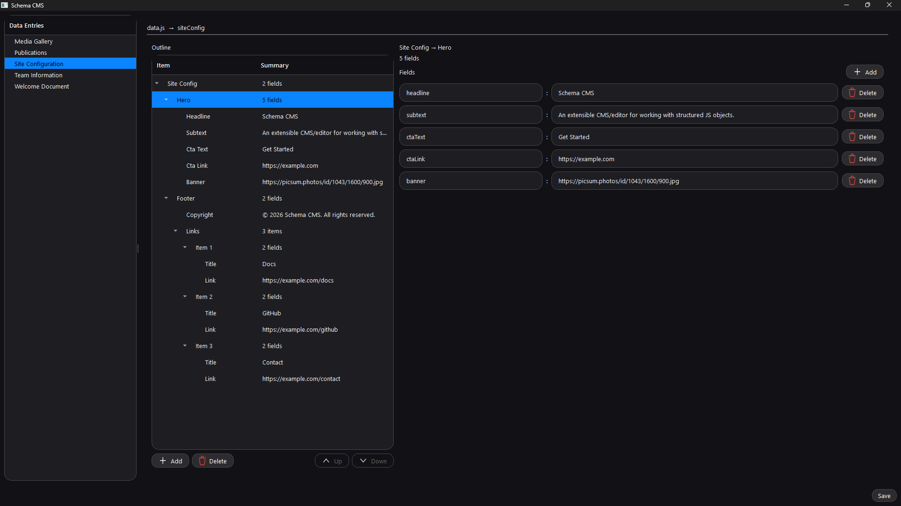

# schema-cms

> An extensible CMS/editor for working with structured JS objects.

## Quick start

```bash
python -m schema_cms
```

## Configuration

### Environment variables

| Purpose                 | Description                                            | Variable                       | Default           |
|-------------------------|--------------------------------------------------------|--------------------------------|-------------------|
| Data entries directory  | The directory where data entry files are stored.       | `SCHEMA_CMS_DATA_ENTRIES_DIR`  | `.`               |
| Entry file glob         | The glob pattern to match data entry files.            | `SCHEMA_CMS_ENTRY_GLOB`        | `*.js`            |
| Public images directory | The directory where images are stored.                 | `SCHEMA_CMS_PUBLIC_IMAGES_DIR` | `./public/images` |
| Image path prefix in JS | The path prefix used in JS exports for mapping images. | `SCHEMA_CMS_JS_IMAGE_PREFIX`   | `/images/`        |
| App title               | The title of the application window.                   | `SCHEMA_CMS_APP_TITLE`         | `Schema CMS`      |

Example:

```bash
SCHEMA_CMS_DATA_ENTRIES_DIR=./data-entries
SCHEMA_CMS_ENTRY_GLOB=*.js
SCHEMA_CMS_PUBLIC_IMAGES_DIR=./public/images
SCHEMA_CMS_JS_IMAGE_PREFIX=/images/
SCHEMA_CMS_APP_TITLE="My CMS"
```

### Python configuration API

Takes priority over environment variables if both are set.

| Purpose                 | Function                  |
|-------------------------|---------------------------|
| Data entries directory  | `set_data_entries_dir()`  |
| Entry file glob         | `set_entry_glob()`        |
| Public images directory | `set_public_images_dir()` |
| Image path prefix in JS | `set_js_image_prefix()`   |
| App title               | `set_app_title()`         |

Example:

```python
from schema_cms.config import (
    set_data_entries_dir,
    set_entry_glob,
    set_public_images_dir,
    set_js_image_prefix,
    set_app_title,
)

set_data_entries_dir("./data-entries")
set_entry_glob("*.js")
set_public_images_dir("./public/images")
set_js_image_prefix("/images/")
set_app_title("My CMS")
```

## Customization

### Registering schemas

| Type            | Function                   | Example    |
|-----------------|----------------------------|------------|
| Document schema | `register_schema()`        | `"page"`   |
| Object schema   | `register_object_schema()` | `"person"` |

```python
from schema_cms import ext

ext.register_schema("page", {"kind": "document"})
ext.register_object_schema("person", {
    "name": "string",
    "img":  "image",
})
```

### Built-in editors

| Editor type     | Schema kind             | Description                                                                                                                                               |
|-----------------|-------------------------|-----------------------------------------------------------------------------------------------------------------------------------------------------------|
| MarkdownEditor  | `document`              | Editor for document or markdown fields.                                                                                                                   |
| MediaListEditor | `asset_collection`      | Editor for media lists (images/videos). Uses configured JS prefix and local public images dir for picking and previews.                                   |
| TableEditor     | `collection`            | Editor for list of dict collections. Uses `item_schema` to look up an object schema and renders rows in a table; supports add/edit/delete and reordering. |
| GraphEditor     | `graph`                 | Editor for nested dict/list structures with schema-aware behavior (`item_schema` for lists and `field_schemas` for dicts).                                |
| MarkdownEditor  | _(fallback: string)_    | If no schema kind matches and `value` is a `str`, edits it as markdown/text.                                                                              |
| GraphEditor     | _(fallback: dict/list)_ | If no schema kind matches and `value` is a `dict` or `list`, edits it as a generic nested structure.                                                      |
| MarkdownEditor  | _(fallback: other)_     | If no schema kind matches and `value` is of another type, converts it to string and edits as markdown/text.                                               |

### Custom editors

Custom editors can be registered for specific schema kinds. The editor factory function receives the `ref`, `value`, and
`context` parameters and should return a `QWidget` instance.

- `ref`: Reference object with metadata about the entry being edited.
  - `ref.file_path`: The path to the data entry file.
  - `ref.export_name`: The name of the export within the file.
- `value`: The current value of the export being edited.
- `context`: Context object with information about the data.
  - `context.schema`
  - `context.object_schemas`
  - `context.title_field`
  - `context.item_schema`

```python
from PySide6.QtWidgets import QWidget

from schema_cms import ext


class MyEditor(QWidget):
    def __init__(self, value, context):
        super().__init__()
        # Custom editor implementation


def editor_factory(ref, value, context):
    return MyEditor(value, context)


ext.register_editor("document", editor_factory)
```

Built-in editors can also be overridden by registering a custom editor for the same schema kind.

### Export labels

Customizes how export names are displayed in the pages tree.

```python
from schema_cms import ext

ext.set_export_label_resolver(lambda name: name.replace("_", " ").title())
```

## Schemas

Schemas define the structure and types of data entries. If no schemas are registered, the editor will use default
behavior based on inferring types from the data.

### Entry schemas

These are the top-level exports for data entry files.

| Property      | Type             | Applies to        | Description                                                                                                                |
|---------------|------------------|-------------------|----------------------------------------------------------------------------------------------------------------------------|
| kind          | `str`            | all               | Selects which editor to use. If omitted, the editor is chosen by inferring the value type (`str`, `list`, `dict`, etc.).   |
| title_field   | `str`            | collection, graph | Specifies which field to use as the title in the editor UI.                                                                |
| item_schema   | `str`            | collection, graph | Name of an object schema used to interpret items when the value is a list.                                                 |
| field_schemas | `dict[str, str]` | graph             | Mapping of field name to schema key. Used to explicitly type specific dict fields.                                         |
| reverse       | `bool`           | collection        | If `True`, makes the table's serial numbers count from the end without changing the actual data order. Default is `False`. |

```js
export const content = `# Hello`;
export const someData = [
    {name: "Item 1", value: 10},
    {name: "Item 2", value: 20},
];
```

The names (`content`, `someData`) correspond to the schema keys.

### Object schemas

These define the structure of objects used within entry schemas or other object schemas.

| Property     | Type  | Description                                                                                   |
|--------------|-------|-----------------------------------------------------------------------------------------------|
| <field_name> | `str` | Name of the field mapped to its type.                                                         |
| kind         | `str` | Allows an object schema to behave like an editor node and be referenced from `field_schemas`. |
| item_schema  | `str` | Used when `kind` is `collection` to define the schema for list items.                         |

Common field types:

- `string`: A simple text field.
- `number`: A numeric field.
- `image`: An image field that uses the configured JS prefix and local public images dir for picking and previews.

```js
export const person = {
    name: "John Doe",
    img: "/images/person.jpg",
};
```

The schema key (`person`) is used in entry schemas or other object schemas to reference this structure.

### Schema kinds

The `kind` property defines which editor to use for an export.

- `document`: This can be used for template strings, multi-line strings, markdown content, or any large plain text.

> Example:
>
> ```python
> ext.register_schema("content", {
>     "kind": "document",
> })
> ```
>
> For data like:
>
> ```js
> export const content = `# Hello World
> This is a sample document.
> `;
> ```
>
> 

- `collection`: A list of items with a defined `item_schema`.

> Each row corresponds to one object in the list, and the columns are defined by the object schema referenced by
`item_schema`.
>
> The `title_field` property can be used to specify which field to use as the title in the editor UI.
>
> The `reverse` property can be set to `True` to make the table's serial numbers count from the end without changing the
> actual data order. Default is `False`.
>
> Example:
>
> ```python
> ext.register_schema("journals", {
>     "kind": "collection",
>     "item_schema": "publication",
>     "title_field": "Journals",
>     "reverse": True,
> })
> ext.register_object_schema("publication", {
>     "title": "string",
>     "year": "number",
> })
> ```
>
> For data like:
>
> ```js
> export const journals = [
>     { title: "Research on X", year: 2020 },
>     { title: "Advances in Y", year: 2021 },
> ];
> ```
>
> 
>
> If no `item_schema` is provided, the types will be inferred from the items.

- `asset_collection`: A list of media assets (images/videos).

> Example:
>
> ```python
> ext.register_schema("media", {
>     "kind": "asset_collection",
> })
> ```
>
> For data like:
>
> ```js
> export const media = [
>     "/media/photo1.jpg",
>     "/media/epic stuff.png",
>     "/media/cool_video.mp4",
> ];
> ```
>
> 

- `graph`: A nested structure of dicts/lists with defined `field_schemas` and/or `item_schema`.

> The `field_schemas` property is a dict mapping field names to their respective schema keys (for dict fields). These
> can be further nested schemas.
>
> The `item_schema` property defines the schema key for list items (for list fields).
>
> The `title_field` property can be used to specify which field to use as the title in the editor UI.
>
> Example:
>
> ```python
> ext.register_schema("team", {
>     "kind": "graph",
>     "title_field": "Team",
>     "field_schemas": {
>         "lead": "person",
>         "members": "person",
>     },
> })
> ext.register_object_schema("person", {
>     "name": "string",
>     "img":  "image",
> })
> ```
>
> For data like:
>
> ```js
> export const team = {
>     lead: { name: "Alice", img: "/images/alice.jpg" },
>     members: [
>         { name: "Bob", img: "/images/bob.jpg" },
>         { name: "Charlie", img: "/images/charlie.jpg" },
>     ],
> };
> ```
>
> 

If no `kind` is specified, the editor falls back to default behavior based on the value type.

If a custom editor is registered for a specific `kind`, it will take priority.
